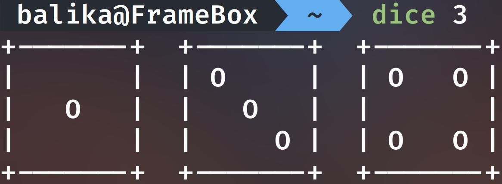

# A dice program written in Java

## ... but why?
I made this because I was bored and wanted an easy project to bang out in a text editor, but realized that making the dice render next to eachother would add some challenge to the program, while distinguishing itself from other similar programs.

## Instructions

Launch the program with `dice` if you have the `dice` script in your path and have made it executable with `chmod +x /path/to/dice`
This will display one randomized die. 

Multiple dice can be displayed at once with an integer argument immedietly following the `dice` command.

## Example

